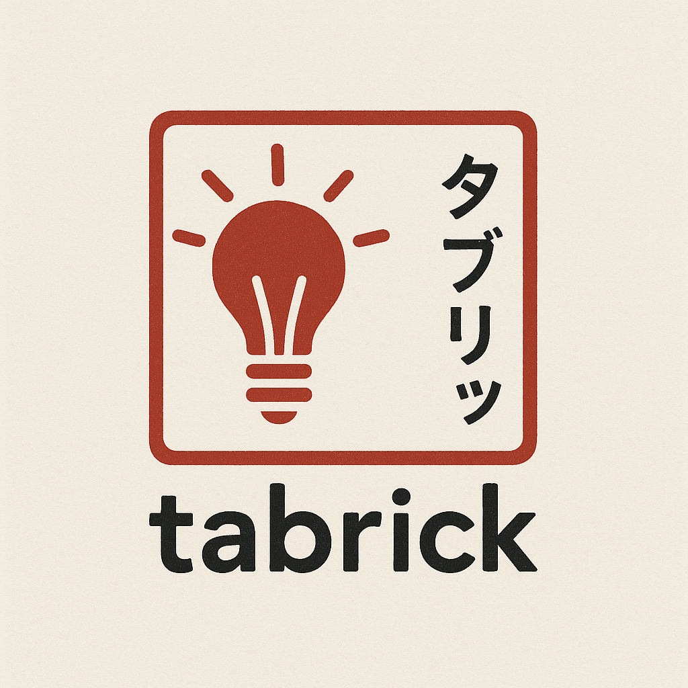

# Tabrick

**Tabrick** is an intelligent Django application for document and data analysis and querying. The project combines AI document processing technologies and data analysis to offer a unified platform for insights based on:

- **PDF Analysis** using RAG (Retrieval-Augmented Generation) with OpenAI
- **CSV Data Analysis** using pandas agents with LangChain
- **Scanned Document Processing** with Google Document AI
- **Intuitive Web Interface** for document upload and querying

# Videos

## v2 Demo Video
https://github.com/user-attachments/assets/0e9e7f45-aedc-4fb6-ad29-4b12e0ec5516


## v1 Demo Video
https://github.com/user-attachments/assets/f23bfd36-1a87-47a1-804d-7e17d52cb008

------
## ✨ Key Features

### 📄 PDF Processing
- Upload and analysis of PDF documents
- Intelligent text extraction using Document AI (for scanned PDFs)
- RAG system with ChromaDB for semantic queries
- Conversation history and context maintained

### 📊 CSV Data Analysis
- Upload and processing of CSV files
- Intelligent pandas agent for statistical analysis
- Natural language queries about data
- Automatic table and visualization generation

### 🔍 Multimodal Queries
- Combined queries between PDFs and CSVs
- Filters by specific file
- Contextualized responses in markdown
- Cited sources for traceability

### 🛠️ Advanced Features
- Loaded file management
- Knowledge base cleanup
- CSV export of results
- Responsive interface with Bootstrap

## 🏗️ System Architecture

The project uses a modular architecture based on Django:

```
tabrick/
├── uploader/               # Main app
│   ├── views.py           # Controllers and business logic
│   ├── rag_utils.py       # RAG system and Document AI
│   ├── forms.py           # Django forms
│   ├── models.py          # Data models
│   ├── templates/         # HTML templates
│   └── static/            # Static files
├── uploads/               # Uploaded files directory
├── chroma_db/             # ChromaDB vector database
└── data/                  # Example datasets
```

## 🔧 Technologies Used

- **Backend**: Django, Python
- **AI/ML**: OpenAI GPT-4, LangChain, ChromaDB
- **Document Processing**: Google Document AI, PyPDF
- **Data Analysis**: Pandas, NumPy
- **Frontend**: HTML, CSS, Bootstrap, JavaScript
- **Others**: python-dotenv, markdown

## ⚙️ Setup

### Prerequisites
- Python 3.8+
- OpenAI account with API key
- (Optional) Google Cloud project with Document AI enabled

### Environment Variables
Create a `.env` file in the project root:

```env
OPENAI_API_KEY=your_openai_api_key
DOCUMENT_AI_PROJECT_ID=your_gcp_project_id (optional)
DOCUMENT_AI_LOCATION=your_location (optional)
DOCUMENT_AI_PROCESSOR_ID=your_processor_id (optional)
```

## 🚀 How to Run

1. **Clone the repository:**
   ```bash
   git clone https://github.com/PedroMatumoto/tabrick.git
   cd tabrick
   ```

2. **Create a virtual environment:**
   ```bash
   python -m venv venv
   venv\Scripts\activate  # Windows
   # or
   source venv/bin/activate  # Linux/Mac
   ```

3. **Install dependencies:**
   ```bash
   pip install -r requirements.txt
   ```

4. **Configure environment variables:**
   - Copy the `.env.example` file to `.env`
   - Add your API keys

5. **Run migrations:**
   ```bash
   cd tabrick
   python manage.py migrate
   ```

6. **Start the server:**
   ```bash
   python manage.py runserver
   ```

7. **Access the application:**
   - Open your browser at `http://localhost:8000`

## 📝 How to Use

1. **File Upload**: Upload PDFs or CSVs through the interface
2. **Queries**: Type natural language questions about your documents
3. **Multimodal Analysis**: Combine information from PDFs and CSV data
4. **Filters**: Select specific files for targeted queries
5. **History**: Track conversation history and context

## 🤝 Contributing

Contributions are welcome! Feel free to:
- Report bugs
- Suggest new features
- Submit pull requests

## 📄 License

This project is under the Creative Commons Attribution-NonCommercial-NoDerivatives 4.0 International License. See the [LICENSE](LICENSE) file for more details.

[](https://creativecommons.org/licenses/by-nc-nd/4.0/)
